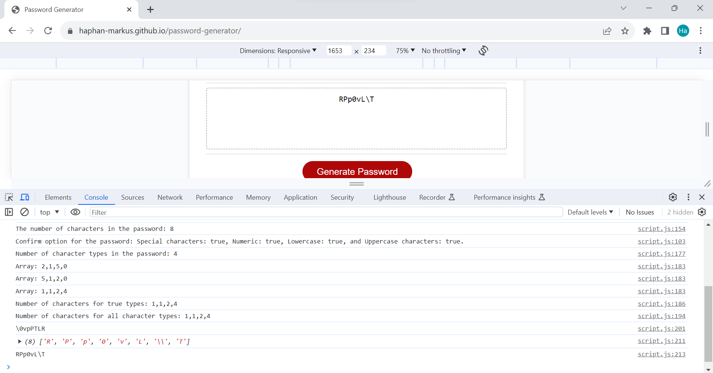
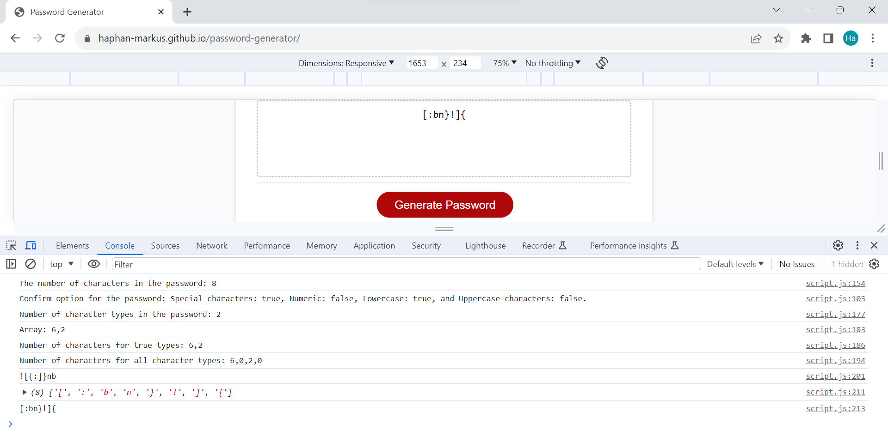
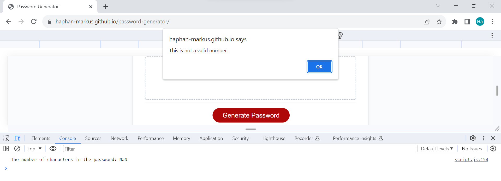
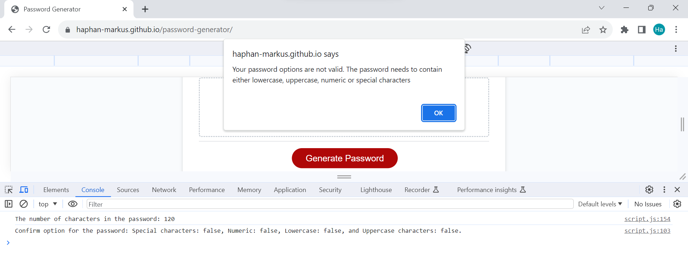
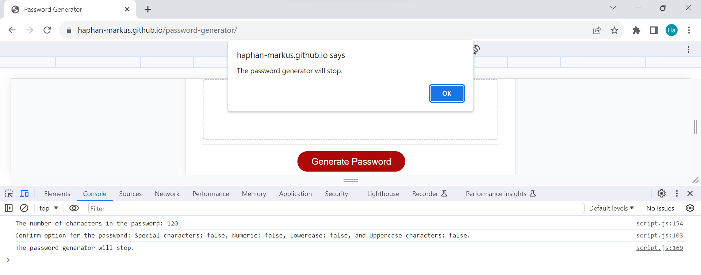

# Password Generator

## Description

The password generator website allows the user to generate a random password based on a series of selected criteria. When opening the website, an user will be prompted through a series of questions to confirm their choices. The final password will be displayed on the website.

* A password is generated when the button is clicked
  * Present a series of prompts for password criteria
    * Length of password
      * At least 8 characters but no more than 128.
    * Character types
      * Lowercase
      * Uppercase
      * Numeric
      * Special characters ($@%&*, etc)
  * Code should validate for the length of password. If it is not a valid number, the user will be alerted.
  * Code will consider each input and at least one character type should be selected. If the user does not choose any character types, an alert will show to notify the user.
  * Once prompts are answered then the password is generated and written to the page

## Usage

The deployed website: https://haphan-markus.github.io/password-generator/ 

## Visual

An example of a password generated with 8 characters with 4 types of characters:

A password generated with 8 characters with 2 types of characters (special characters and lowercase characters):

Alert for invalid number input from user:

Alert for invalid selections of types of characters:

## License

[MIT](https://choosealicense.com/licenses/mit/)